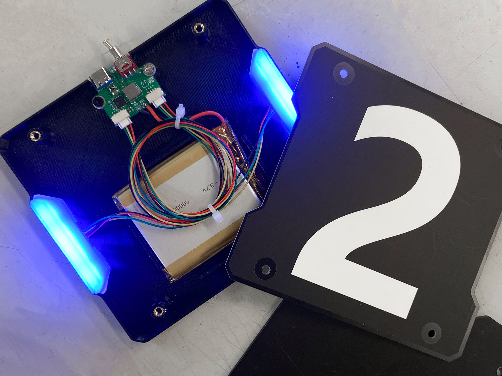
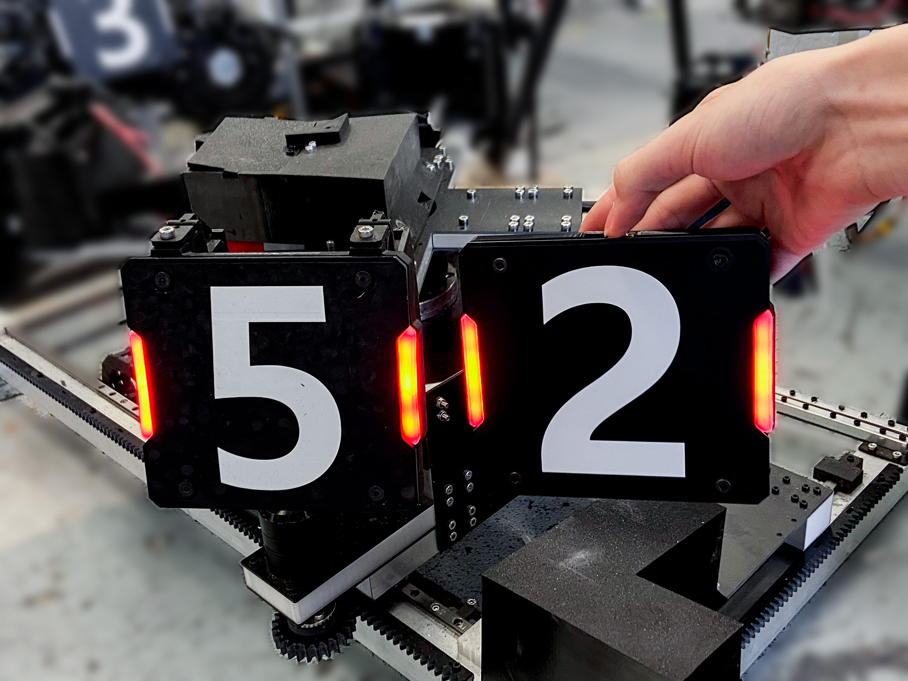
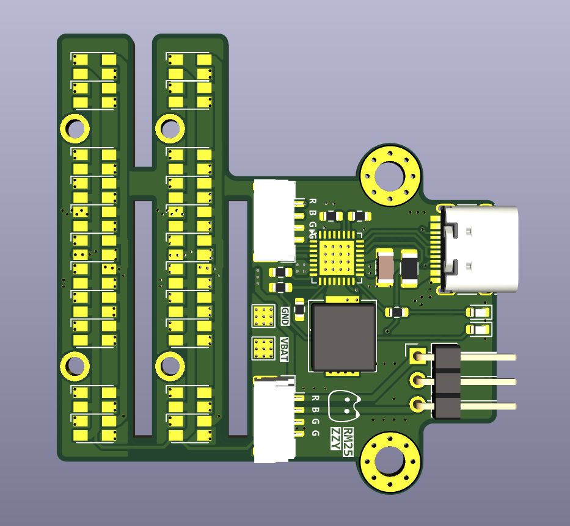

# 低成本,高仿真手持装甲板
3D打印,低成本,高仿真手持装甲板. CV 调试用, 不可击打.

如图左为官方装甲板, 右图为我们自己的 3D 打印装甲板, 其亮度颜色形状高度一致.

## 硬件

> 灯珠与驱动板采用拼板设计. 可在 JLC 免费打样.

**硬件选型**
|部件|型号||
|:--|:--|:--|
|锂电池充电管理|IP2315|1s 锂电池快充|
|红蓝LED|3528红蓝双色交叉异极|与官方一致|
|开关|2.54mm 扭子开关 3 弯脚 3 档|

我们实测发现 IP5306, IP5407 等常见的电池充放电管理芯片静态功耗高. 对于几百 mAh 的小锂电池, 一两个星期就漏电漏完了. 故选择 IP2315 1S 锂电池快充芯片, 请根据锂电池容量大小调整充电电流配置电阻. 1C 为宜.
实测锂电池电压波动对亮度影响较小, 始终与官方装甲板亮度保持一致.

灯板排布, 灯珠选型, 灯板引脚定义都与官方装甲板一致. 本方案能较好模拟灯珠颗粒感. 

**焊接指南**
焊接时需要去掉 Type-c 插座的定位塑料柱. 扭子开关需去掉固定柱, 焊接在 3P 排针焊盘. Type-C, 扭子开关为易损件, 请打紫外胶固定.

## 机械
灯罩请使用白色 PETG 打印. 本体使用黑色 PETG. 铜螺母尺寸请按需修改.
./Mechanics/Production 文件夹下的文件可直接打印/切板

